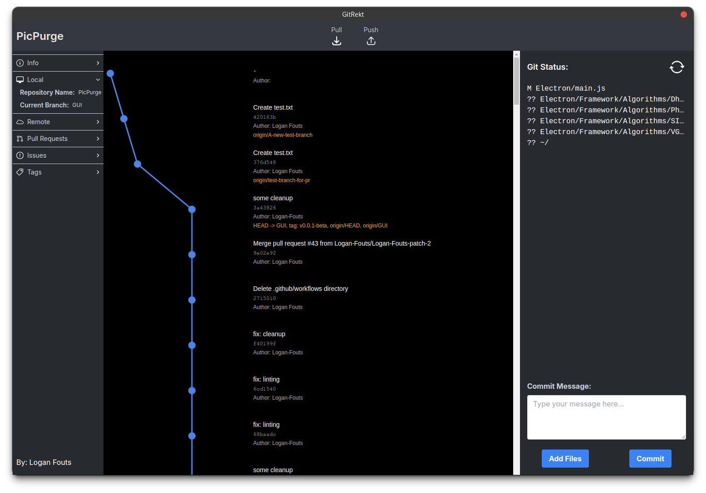

# GitRekt

GitRekt is a React/Electron application designed to make git easy.



## Table of Contents
- [Installation](#installation)
- [Usage](#usage)
- [Development](#development)
- [Building](#building)
- [Contributing](#contributing)
- [License](#license)

## Installation

To install GitRekt, follow these steps:

1. Clone the repository:
   ```
   git clone https://github.com/Logan-Fouts/gitrekt.git
   ```
2. Navigate to the project directory:
   ```
   cd gitrekt
   ```
3. Install dependencies:
   ```
   npm install
   ```

## Usage

To run GitRekt in development mode:

```
npm run dev
```

This will start both the React development server and the Electron app.

## Development

GitRekt is built using React for the frontend and Electron for the desktop application wrapper. The main page is located in `src/page.js`.

## Contributing

Contributions are welcome! Please feel free to submit a Pull Request.
